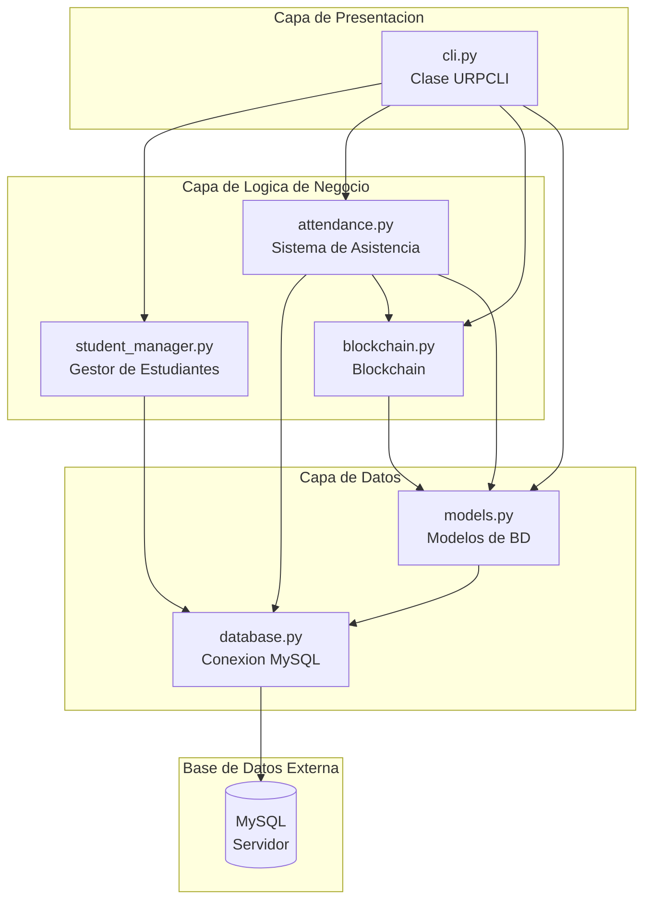
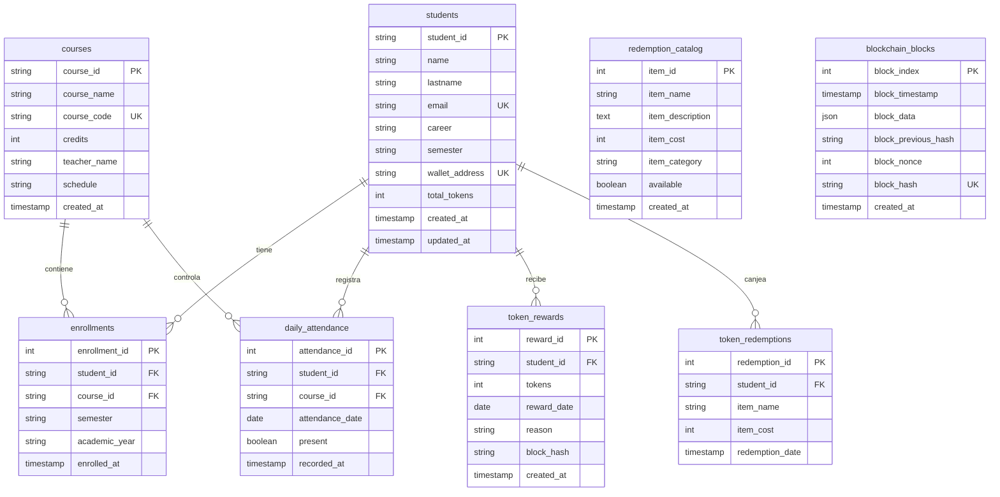
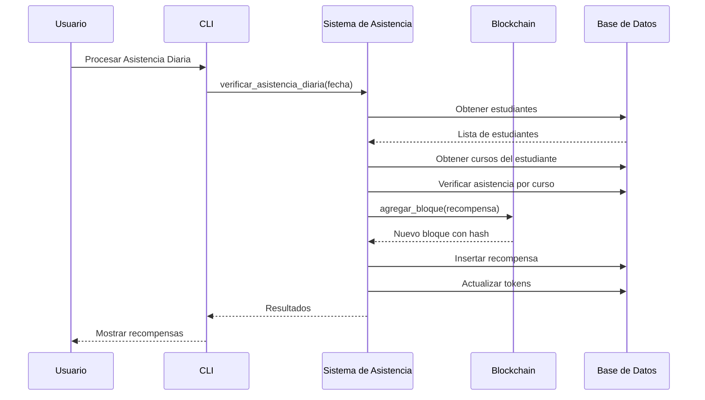
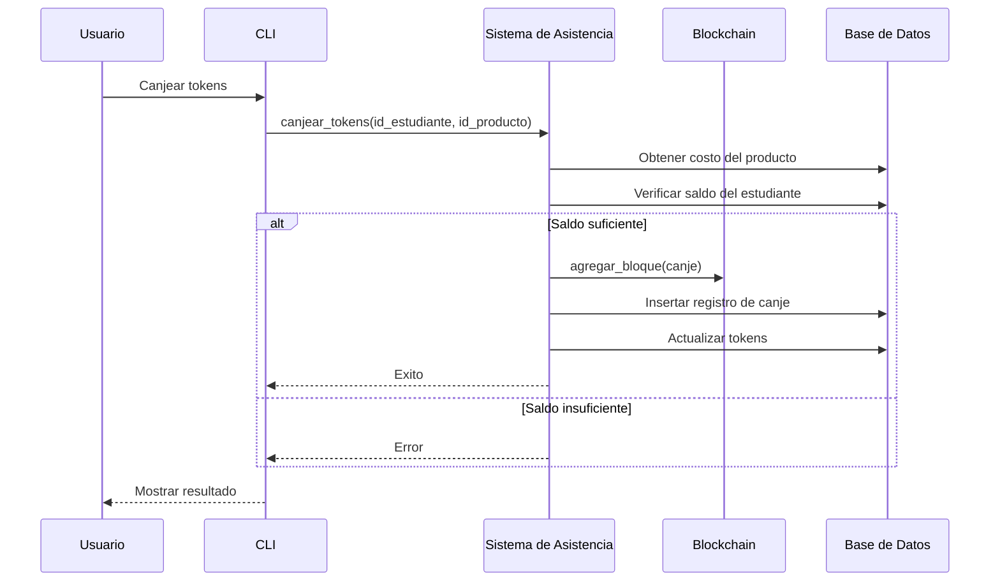

# Blockchain URP - Documento de Arquitectura

## Descripcion del Proyecto

**Blockchain URP** es una aplicacion blockchain basada en Python para la Universidad Ricardo Palma que registra la asistencia de estudiantes y recompensa con tokens a quienes asisten a todos sus cursos en un dia.

---

## Arquitectura del Sistema



---

## Descripcion de Modulos

### 1. Capa de Presentacion

| Modulo | Responsabilidad |
|--------|-----------------|
| main.py | Punto de entrada; muestra banner y ejecuta CLI |
| cli.py | Interfaz de linea de comandos con 14 opciones de menu |

---

### 2. Capa de Logica de Negocio

| Modulo | Responsabilidad |
|--------|-----------------|
| student_manager.py | Gestiona estudiantes, cursos y matriculas |
| attendance.py | Registra asistencia, procesa recompensas diarias, maneja canje de tokens |
| blockchain.py | Implementa blockchain con Prueba de Trabajo |

---

### 3. Capa de Datos

| Modulo | Responsabilidad |
|--------|-----------------|
| database.py | Gestor de conexion MySQL con proteccion contra SQL injection |
| models.py | Creacion de tablas, datos de ejemplo, operaciones CRUD |

---

## Esquema de Base de Datos



---

## Flujo de Datos

### Flujo de Recompensa de Tokens


### Flujo de Canje de Tokens


---

## Caracteristicas Principales

1. **Implementacion de Blockchain**
   - Hashing SHA-256
   - Prueba de Trabajo con dificultad 2
   - Bloque genesis
   - Validacion de cadena

2. **Sistema de Tokens**
   - 1 token por dia por asistencia perfecta
   - Catalogo de productos para canje
   - Historial de transacciones

3. **Integracion con MySQL**
   - Creacion automatica de base de datos
   - Restricciones de clave foranea
   - Datos de ejemplo precargados

---

## Configuracion

| Parametro | Valor por Defecto | Variable de Entorno |
|-----------|-------------------|---------------------|
| Host | localhost | DB_HOST |
| Usuario | root | DB_USER |
| Contrasena | 123456 | DB_PASSWORD |
| Base de datos | urp_blockchain | - |

---

## Estructura de Archivos

```
LINUX/
├── main.py                 # Punto de entrada
├── database.py             # Conexion a MySQL
├── models.py              # Tablas de BD
├── blockchain.py          # Implementacion de blockchain
├── student_manager.py     # Gestion de estudiantes
├── attendance.py          # Sistema de asistencia
├── cli.py                 # Interfaz de comandos
├── requirements.txt       # Dependencias
└── README.md             # Documentacion
```

---

## Tablas de Base de Datos

El sistema utiliza 8 tablas en MySQL:

1. **students** - Informacion de estudiantes
2. **courses** - Catalogo de cursos
3. **enrollments** - Matriculas de estudiantes
4. **daily_attendance** - Registro de asistencia diaria
5. **token_rewards** - Recompensas de tokens otorgados
6. **token_redemptions** - Canjes de tokens realizados
7. **redemption_catalog** - Productos disponibles para canje
8. **blockchain_blocks** - Bloques de la blockchain
