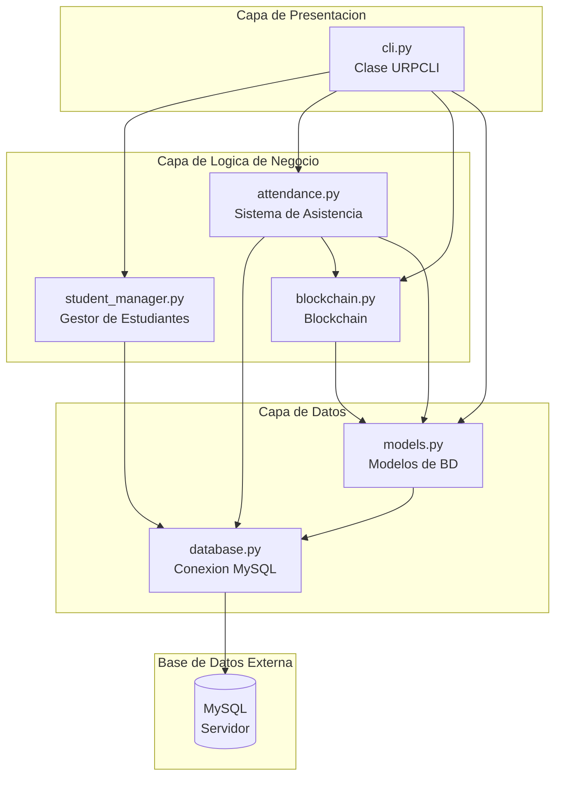
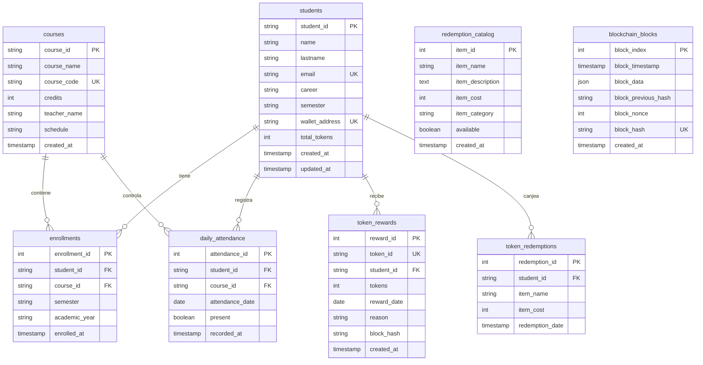
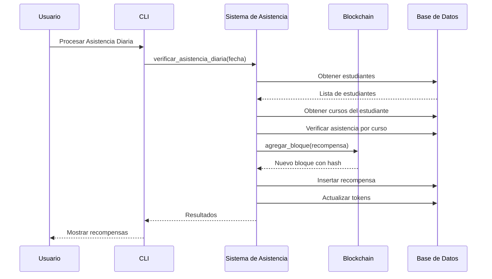
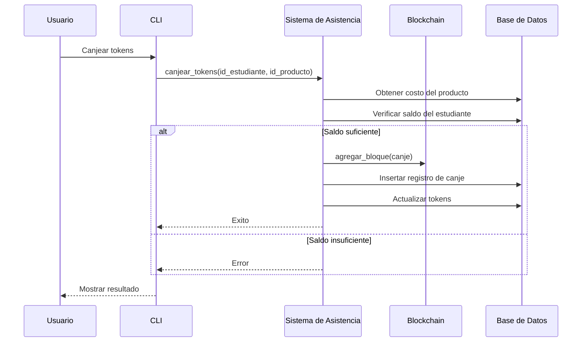

# Blockchain URP - Documento de Arquitectura

## Descripcion del Proyecto

**Blockchain URP** es una aplicacion blockchain basada en Python para la Universidad Ricardo Palma que registra la asistencia de estudiantes y recompensa con tokens a quienes asisten a todos sus cursos en un dia.

---

## Arquitectura del Sistema



---

## Descripcion de Modulos

### 1. Capa de Presentacion

| Modulo | Responsabilidad |
|--------|-----------------|
| main.py | Punto de entrada; muestra banner y ejecuta CLI |
| cli.py | Interfaz de linea de comandos con 14 opciones de menu |

---

### 2. Capa de Logica de Negocio

| Modulo | Responsabilidad |
|--------|-----------------|
| student_manager.py | Gestiona estudiantes, cursos y matriculas |
| attendance.py | Registra asistencia, procesa recompensas diarias, maneja canje de tokens |
| blockchain.py | Implementa blockchain con Prueba de Trabajo |

---

### 3. Capa de Datos

| Modulo | Responsabilidad |
|--------|-----------------|
| database.py | Gestor de conexion MySQL con proteccion contra SQL injection |
| models.py | Creacion de tablas, datos de ejemplo, operaciones CRUD |

---

## Esquema de Base de Datos



---

## Flujo de Datos

### Flujo de Recompensa de Tokens


### Flujo de Canje de Tokens


---

## Caracteristicas Principales

1. **Tokens Unicos e Intransferibles**
   - Cada token es unico y no puede ser copiado
   - Cada token esta registrado en la blockchain con hash unico
   - No existe duplicacion posible gracias a la estructura de la cadena
   - Trazabilidad completa del origen y uso de cada token

2. **Implementacion de Blockchain**
   - Hashing SHA-256
   - Prueba de Trabajo con dificultad 2
   - Bloque genesis
   - Validacion de cadena

3. **Sistema de Tokens**
   - 1 token por dia por asistencia perfecta
   - Catalogo de productos para canje
   - Historial de transacciones

4. **Integracion con MySQL**
   - Creacion automatica de base de datos
   - Restricciones de clave foranea
   - Datos de ejemplo precargados

---

## Tokens Unicos en la Blockchain

Cada token generado en el sistema es unico y esta vinculado a la blockchain. Esto garantiza:

- **No hay duplicacion**: Cada token tiene un hash unico en la cadena
- **No hay falsificacion**: Cualquier intento de modificar un token invalida la cadena
- **Trazabilidad**: Cada token puede rastrearse desde su creacion hasta su uso

### Estructura de un Token

```
Token {
    token_id: UUID unico,
    student_id: ID del estudiante,
    reward_date: Fecha de obtencion,
    block_hash: Hash del bloque donde se registro,
    nonce_unique: Identificador unico del bloque
}
```

Cuando un estudiante asiste a todos sus cursos:
1. Se genera un token_id unico (UUID)
2. Se crea un nuevo bloque con los datos del token
3. Se calcula el hash del bloque con Prueba de Trabajo
4. El bloque se agrega a la cadena (inmutable)
5. El token queda registrado permanentemente

### Validacion de Tokens

Al canjear un token, el sistema:
1. Verifica que el token existe en la blockchain
2. Confirma que el hash del bloque es valido
3. Valida la integridad de toda la cadena

---

## Consideraciones Tecnicas Importantes

### 1. La Paradoja de la Blockchain Centralizada

Al almacenar los bloques en una base de datos MySQL tradicional controlada por una sola entidad (la universidad), se pierde la principal caracteristica de una blockchain: la descentralizacion.

Lo que se ha construido es mas bien un **registro inmutable** (tamper-evident log).

**Sobre el Proof of Work (PoW):**
- Implementar PoW con dificultad 2 en un servidor centralizado solo anade latencia artificial
- El PoW sirve para generar consenso entre nodos desconfiados en una red distribuida
- Como se controla el unico nodo (el backend de Python), nadie compite por minar

**Nota:** Si el proyecto es puramente educativo, es una gran implementacion.

### 2. El Problema de Consultas N+1 (Rendimiento)

El flujo actual de recompensas de tokens tiene este problema:
1. Obtener todos los estudiantes (1 consulta)
2. Por cada estudiante, obtener sus cursos (N consultas)
3. Verificar asistencia por curso (N*M consultas)

Si la URP tiene 15,000 estudiantes matriculados en 5 cursos cada uno:
- 1 consulta para traer alumnos
- 15,000 consultas para cursos
- Decenas de miles de consultas de asistencia

Esto hara colapsar la base de datos.

**Solucion:** Optimizar utilizando JOIN de SQL para traer de una sola vez a los estudiantes con asistencia perfecta en un dia especifico.

### 3. La Capa de Presentacion (CLI)

El CLI tiene 14 opciones de menu. Para una aplicacion universitaria necesitara eventualmente una interfaz web o movil.

**Arquitectura limpia:** El cli.py no debe contener logica de negocio, solo capturar inputs e imprimir outputs. Esto permitira reemplazar el CLI por una API REST (FastAPI o Flask) en el futuro.

---

## Configuracion

| Parametro | Valor por Defecto | Variable de Entorno |
|-----------|-------------------|---------------------|
| Host | localhost | DB_HOST |
| Usuario | root | DB_USER |
| Contrasena | 123456 | DB_PASSWORD |
| Base de datos | urp_blockchain | - |

---

## Estructura de Archivos

```
LINUX/
├── main.py                 # Punto de entrada
├── database.py             # Conexion a MySQL
├── models.py              # Tablas de BD
├── blockchain.py          # Implementacion de blockchain
├── student_manager.py     # Gestion de estudiantes
├── attendance.py          # Sistema de asistencia
├── cli.py                 # Interfaz de comandos
├── requirements.txt       # Dependencias
└── README.md             # Documentacion
```

---

## Tablas de Base de Datos

El sistema utiliza 8 tablas en MySQL:

1. **students** - Informacion de estudiantes
2. **courses** - Catalogo de cursos
3. **enrollments** - Matriculas de estudiantes
4. **daily_attendance** - Registro de asistencia diaria
5. **token_rewards** - Recompensas de tokens otorgados
6. **token_redemptions** - Canjes de tokens realizados
7. **redemption_catalog** - Productos disponibles para canje
8. **blockchain_blocks** - Bloques de la blockchain
